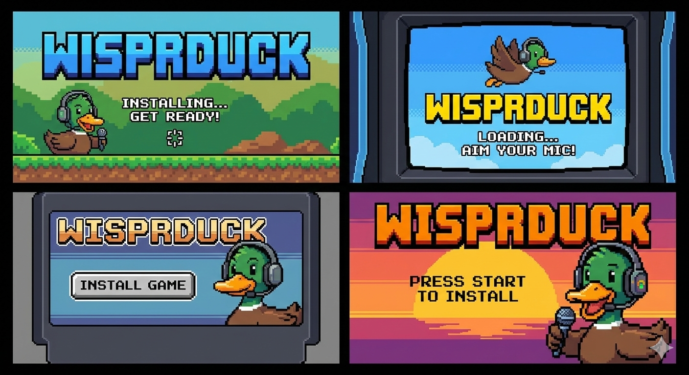

<p align="center">
  
</p>

<h1 align="center">Shhh... Ducking Volume</h1>

<p align="center">
  <strong>Auto-duck background audio when your mic is active.</strong><br>
  A lightweight macOS menu bar utility for voice-to-text, calls, and recording.
</p>

<p align="center">
  <a href="../../releases/latest"></a>
  
  
</p>

---

## What is WisprDuck?

WisprDuck sits in your menu bar and watches for microphone activity. When a selected app starts using the mic — voice-to-text tools like [Wispr Flow](https://wispr.com), video calls, screen recordings — WisprDuck automatically lowers the volume of other apps so your voice comes through clearly. When the mic goes idle, volume smoothly fades back up.

No manual toggling. No keyboard shortcuts. Just works.

## Features

- **Per-app mic triggers** — choose which apps trigger ducking (e.g., only Wispr Flow) or duck on any mic use
- **Per-app duck targets** — duck all audio or pick specific apps (Spotify, Chrome, Arc, etc.)
- **Smart defaults** — Wispr Flow pre-selected as trigger, 20+ common audio apps pre-selected as duck targets
- **Smooth linear fade** — 1-second constant-rate volume transitions, no harsh jumps
- **Crash-safe** — uses `mutedWhenTapped` so audio auto-restores if WisprDuck quits unexpectedly
- **Lightweight** — event-driven Core Audio listeners, no polling, minimal CPU usage
- **Smart grouping** — Chrome helpers, Slack workers, etc. automatically group under their parent app

## Installation

1. Clone the repo and [build from source](#building-from-source), or download a build from the [releases page](../../releases/latest)
2. Drag **WisprDuck.app** to `/Applications`
3. Launch WisprDuck
4. On first launch: right-click the app → **Open** (required for unsigned apps)
5. Grant **microphone access** when prompted
6. Grant **Screen & System Audio Recording** access (audio-only is supported)

> WisprDuck runs as a menu bar app — no Dock icon. Look for the duck foot in your menu bar.

## How It Works

WisprDuck uses [Core Audio process taps](https://developer.apple.com/documentation/coreaudio) (macOS 14.2+) to intercept audio at the system level. When a trigger app activates the mic:

1. **Detect** — Per-process Core Audio listeners detect which app is using the mic input
2. **Match** — The active mic app is checked against your trigger list (or triggers on any mic use)
3. **Tap** — Process taps are created for target apps, muting their original audio at the system mixer
4. **Scale** — The intercepted audio is scaled by the duck level and played through an aggregate device
5. **Restore** — When the mic goes idle, volume linearly ramps back to 100% over ~1 second, then taps are destroyed

The `mutedWhenTapped` behavior is the safety net: if WisprDuck crashes or is force-quit, macOS automatically unmutes all tapped processes. Audio is never permanently stuck at a low volume.

## Configuration

Click the duck foot icon in your menu bar:

| Setting | Description |
|---------|-------------|
| **Enable Monitoring** | Toggle WisprDuck on/off |
| **Duck Level** | Target volume when ducked — 0% is silent, 100% is full volume (default 10%) |
| **Trigger All Apps** | Duck on any mic use, or toggle off to pick specific trigger apps |
| **Duck All Apps** | Duck every audio app, or toggle off to pick specific apps to duck |

## Requirements

- **macOS 14.2+** (Sonoma) — required for Core Audio process taps
- **Microphone permission** — required to access microphone state on macOS
- **Screen & System Audio Recording permission** — required to capture and scale other apps’ audio

## Building from Source

```bash
git clone https://github.com/kalepail/wispr-duck.git
cd wispr-duck
open WisprDuck.xcodeproj
```

Build and Run with **Cmd+R** in Xcode. Requires Xcode 15+ with the macOS 14.2+ SDK.

## License

Apache 2.0 — see [LICENSE](LICENSE) for details.
